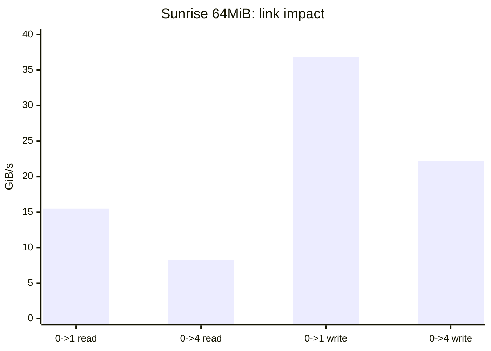

# SunriseLink Performance Report

- Generated at: 2026-04-13T17:17:46
- Scope: `transfer_engine_sunrise_bench` sunrise_link path only (`sunrise_use_mapped_host_vram=false`)
- Host: `10.21.60.35`
- Unit: `GiB/s`

## Test Matrix (sunrise_bench)

| Config          | Threads | Batch | Block Size | Buffer Size | Link | Op    | Throughput  | RC  |
| --------------- | ------- | ----- | ---------- | ----------- | ---- | ----- | ----------- | --- |
| T1_B1M_BUF64M   | 1       | 32    | 1048576    | 67108864    | 0->1 | read  | 12.08 GiB/s | 0   |
| T1_B1M_BUF64M   | 1       | 32    | 1048576    | 67108864    | 0->1 | write | 20.88 GiB/s | 0   |
| T1_B1M_BUF64M   | 1       | 32    | 1048576    | 67108864    | 0->4 | read  | 7.25 GiB/s  | 0   |
| T1_B1M_BUF64M   | 1       | 32    | 1048576    | 67108864    | 0->4 | write | 14.33 GiB/s | 0   |
| T4_B1M_BUF256M  | 4       | 32    | 1048576    | 268435456   | 0->1 | read  | 10.29 GiB/s | 0   |
| T4_B1M_BUF256M  | 4       | 32    | 1048576    | 268435456   | 0->1 | write | 16.91 GiB/s | 0   |
| T4_B1M_BUF256M  | 4       | 32    | 1048576    | 268435456   | 0->4 | read  | 6.47 GiB/s  | 0   |
| T4_B1M_BUF256M  | 4       | 32    | 1048576    | 268435456   | 0->4 | write | 13.69 GiB/s | 0   |
| T1_B8M_BUF256M  | 1       | 8     | 8388608    | 268435456   | 0->1 | read  | 14.71 GiB/s | 0   |
| T1_B8M_BUF256M  | 1       | 8     | 8388608    | 268435456   | 0->1 | write | 33.01 GiB/s | 0   |
| T1_B8M_BUF256M  | 1       | 8     | 8388608    | 268435456   | 0->4 | read  | 8.01 GiB/s  | 0   |
| T1_B8M_BUF256M  | 1       | 8     | 8388608    | 268435456   | 0->4 | write | 20.90 GiB/s | 0   |
| T4_B8M_BUF512M  | 4       | 4     | 8388608    | 536870912   | 0->1 | read  | 14.61 GiB/s | 0   |
| T4_B8M_BUF512M  | 4       | 4     | 8388608    | 536870912   | 0->1 | write | 32.27 GiB/s | 0   |
| T4_B8M_BUF512M  | 4       | 4     | 8388608    | 536870912   | 0->4 | read  | 7.97 GiB/s  | 0   |
| T4_B8M_BUF512M  | 4       | 4     | 8388608    | 536870912   | 0->4 | write | 20.68 GiB/s | 0   |
| T1_B64M_BUF64M  | 1       | 1     | 67108864   | 67108864    | 0->1 | read  | 15.47 GiB/s | 0   |
| T1_B64M_BUF64M  | 1       | 1     | 67108864   | 67108864    | 0->1 | write | 36.91 GiB/s | 0   |
| T1_B64M_BUF64M  | 1       | 1     | 67108864   | 67108864    | 0->4 | read  | 8.23 GiB/s  | 0   |
| T1_B64M_BUF64M  | 1       | 1     | 67108864   | 67108864    | 0->4 | write | 22.21 GiB/s | 0   |
| T2_B16M_BUF512M | 2       | 8     | 16777216   | 536870912   | 0->1 | read  | 15.01 GiB/s | 0   |
| T2_B16M_BUF512M | 2       | 8     | 16777216   | 536870912   | 0->1 | write | 34.83 GiB/s | 0   |
| T2_B16M_BUF512M | 2       | 8     | 16777216   | 536870912   | 0->4 | read  | 8.09 GiB/s  | 0   |
| T2_B16M_BUF512M | 2       | 8     | 16777216   | 536870912   | 0->4 | write | 21.45 GiB/s | 0   |

## IPC C2C Baseline (`pccl/test/ipcC2cTest.cpp`)

| Link | Op    | Throughput    | RC  |
| ---- | ----- | ------------- | --- |
| 0->1 | read  | 36.656 GiB/s  | 0   |
| 0->1 | write | 15.4696 GiB/s | 0   |
| 0->4 | read  | 22.2009 GiB/s | 0   |
| 0->4 | write | 8.24093 GiB/s | 0   |

## Focused Comparison (64MiB direction-aligned)

> Direction note: `sunrise_bench` op semantics are opposite to ipc op naming (sunrise read ~= ipc write; sunrise write ~= ipc read).

| Link | Sunrise read | IPC write | Sunrise write | IPC read |
| ---- | ------------ | --------- | ------------- | -------- |
| 0->1 | 15.47        | 15.4696   | 36.91         | 36.656   |
| 0->4 | 8.23         | 8.24093   | 22.21         | 22.2009  |

## Charts

### 1) 64MiB Aligned Comparison (Sunrise vs IPC)

```mermaid
xychart-beta
    title "0->1 (64MiB, direction-aligned)"
    x-axis ["read-path","write-path"]
    y-axis "GiB/s" 0 --> 40
    bar [15.47, 36.91]
    bar [15.4696, 36.656]
```

```mermaid
xychart-beta
    title "0->4 (64MiB, direction-aligned)"
    x-axis ["read-path","write-path"]
    y-axis "GiB/s" 0 --> 24
    bar [8.23, 22.21]
    bar [8.24093, 22.2009]
```

> Legend: first bar = `sunrise_bench`, second bar = `ipcC2cTest` (direction-aligned mapping).

### 2) Link Dimension (Sunrise, 64MiB)

### 3) Block Size Dimension (Sunrise, Threads=1)

```mermaid
xychart-beta
    title "Sunrise 0->1: block size trend (threads=1)"
    x-axis ["1MiB","8MiB","64MiB"]
    y-axis "GiB/s" 0 --> 40
    bar [12.08, 14.71, 15.47]
    bar [20.88, 33.01, 36.91]
```

```mermaid
xychart-beta
    title "Sunrise 0->4: block size trend (threads=1)"
    x-axis ["1MiB","8MiB","64MiB"]
    y-axis "GiB/s" 0 --> 24
    bar [7.25, 8.01, 8.23]
    bar [14.33, 20.90, 22.21]
```

> Legend: first bar = `read`, second bar = `write`.

### 4) Thread Dimension (Sunrise, 8MiB block)

```mermaid
xychart-beta
    title "Sunrise 0->1: thread impact at 8MiB block"
    x-axis ["T1","T4"]
    y-axis "GiB/s" 0 --> 36
    bar [14.71, 14.61]
    bar [33.01, 32.27]
```

```mermaid
xychart-beta
    title "Sunrise 0->4: thread impact at 8MiB block"
    x-axis ["T1","T4"]
    y-axis "GiB/s" 0 --> 24
    bar [8.01, 7.97]
    bar [20.90, 20.68]
```

## Observations

- `0->1` consistently outperforms `0->4` across most configurations, matching topology distance expectations.
- Increasing threads helps small-block configs, but gain saturates for large blocks (e.g. 64MiB).
- Larger block sizes generally improve write-path throughput on sunrise_link until link saturation.
- Under aligned direction comparison, sunrise_link and ipc results are close in magnitude; apparent read/write inversions are naming semantics, not hardware contradiction.

## Raw Data

- CSV: `/tmp/sunrise_link_matrix_1776071019/results.csv`
- Logs: `/tmp/sunrise_link_matrix_1776071019/`

## 10.21.60.35 Multi-Run Retry (same-host, defaults)

- Date: 2026-04-14
- Host/IP: `10.21.60.35`
- Command profile: TENT + `sunrise_link`, `threads=1`, `block_size=8MiB`, `buffer_size=64MiB`, `duration=3s`
- Retry logs: `/tmp/sunrise_retry_1776146385/`

| Op    | Run1       | Run2       | Run3       | Avg        |
| ----- | ---------- | ---------- | ---------- | ---------- |
| read  | 745.51 GB/s | 748.68 GB/s | 745.06 GB/s | 746.42 GB/s |
| write | 748.93 GB/s | 741.54 GB/s | 747.12 GB/s | 745.86 GB/s |

## Why Throughput Looks So Large

- These retry numbers are from **same-host, same default GPU id (`gpu_id=0`) on both target and initiator**.
- In this setup, transfer can degrade into **same-device local copy** (IPC-opened pointer on same GPU context), not inter-GPU/inter-link copy.
- `sunrise_link_transport` has an explicit same-device fast path (`src_dev == dst_dev`) that uses device-local memcpy, which can report hundreds of GB/s.
- So `~746 GB/s` is not the physical `0->1`/`0->4` link bandwidth; it is effectively local VRAM copy throughput in this run mode.

## Control Experiment (cross-GPU)

- Target forced to `gpu_id=1`, initiator forced to `gpu_id=0`:
  - Target: `--gpu_id=1`
  - Initiator: `--gpu_id=0`
- Observed throughput: **18.33 GB/s** (`/tmp/sunrise_gpu01_init.log`)

This control result is in the expected order of magnitude for real cross-GPU path and confirms the retry `~746 GB/s` numbers are from same-device fast path, not link-limited C2C bandwidth.

## Cross-GPU Retries (`gpu0 -> gpu1` and `gpu0 -> gpu4`)

- Date: 2026-04-14
- Host/IP: `10.21.60.35`
- Command profile: TENT + `sunrise_link`, `threads=1`, `block_size=8MiB`, `buffer_size=64MiB`, `duration=3s`
- Fixed mapping:
  - Initiator: `--gpu_id=0`
  - Target: `--gpu_id=1` or `--gpu_id=4`
- Retry logs: `/tmp/sunrise_crossgpu_1776146817/`

| Link | Op    | Run1       | Run2       | Avg        |
| ---- | ----- | ---------- | ---------- | ---------- |
| 0->1 | read  | 18.30 GB/s | 18.30 GB/s | 18.30 GB/s |
| 0->1 | write | 47.55 GB/s | 47.58 GB/s | 47.57 GB/s |
| 0->4 | read  | 9.46 GB/s  | 9.46 GB/s  | 9.46 GB/s  |
| 0->4 | write | 19.79 GB/s | 19.80 GB/s | 19.80 GB/s |

These values are the physically meaningful cross-GPU results and should be used for topology/performance comparison, not the same-GPU `~746 GB/s` retries.

